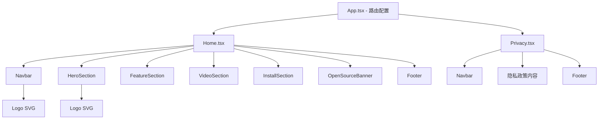

# 技术设计文档：Landing Page

## 概述

为 "Better Sidebar for Gemini & AI Studio" 浏览器扩展构建一个两页式 Landing Page 网站（首页 + 隐私政策页），使用 React + Vite + Tailwind CSS 技术栈。网站采用 SPA 架构配合客户端路由，构建后输出纯静态文件，可部署到任意静态托管服务。

网站的核心目标：
- 向潜在用户展示扩展的价值主张和功能特性
- 提供各浏览器商店的安装入口
- 嵌入 YouTube 介绍视频
- 提供符合 Google Drive 数据同步要求的隐私政策页面
- 同步更新仓库中的 PRIVACY.md 文件

### 设计风格决策

遵循 design-taste-frontend skill 规范：

- **字体**：Outfit（Google Fonts），干净现代，适合产品展示
- **配色**：Zinc/Slate 中性色系 + 单一强调色（Emerald-500 `#10b981`，呼应隐私/安全主题）
- **布局**：高度不对称（DESIGN_VARIANCE: 8），Hero 使用 Split Screen 左对齐布局，功能区使用 Zig-Zag 交替布局
- **动画**：Framer Motion，Spring Physics（stiffness: 100, damping: 20），staggerChildren 瀑布式展示
- **图标**：Phosphor Icons（`@phosphor-icons/react`），禁止 emoji
- **圆角**：卡片 `rounded-[2.5rem]`，diffusion shadow
- **排版**：标题 `text-4xl md:text-6xl tracking-tighter leading-none`，正文 `text-base text-gray-600 leading-relaxed max-w-[65ch]`
- **容器**：`max-w-[1400px] mx-auto`
- **移动端**：单列回退，`min-h-[100dvh]`

## 架构

### 技术栈

| 层级 | 技术选型 | 说明 |
|------|---------|------|
| 框架 | React 19 + Vite | 快速构建，HMR 开发体验 |
| 样式 | Tailwind CSS 4 | 原子化 CSS，配合设计规范 |
| 路由 | React Router v7 | 客户端路由，两页切换 |
| 动画 | Framer Motion | Spring Physics 动画，layout 动画 |
| 图标 | @phosphor-icons/react | 替代 emoji，丰富的图标库 |
| 字体 | Outfit (Google Fonts) | 现代无衬线字体 |
| 构建输出 | 静态 HTML/CSS/JS | Vite 构建，可部署到 GitHub Pages 等 |

### 项目结构

```
├── index.html
├── vite.config.ts
├── tailwind.config.ts
├── package.json
├── tsconfig.json
├── public/
│   └── og-image.png          # Open Graph 预览图
├── src/
│   ├── main.tsx               # 入口
│   ├── App.tsx                # 路由配置
│   ├── index.css              # Tailwind 指令 + 全局样式
│   ├── components/
│   │   ├── Navbar.tsx         # 导航栏
│   │   ├── Footer.tsx         # 页脚
│   │   ├── Logo.tsx           # 手写 SVG Logo 组件
│   │   ├── HeroSection.tsx    # Hero 区域（Split Screen 布局）
│   │   ├── FeatureSection.tsx # 功能展示（Zig-Zag 布局）
│   │   ├── VideoSection.tsx   # YouTube 视频嵌入
│   │   ├── InstallSection.tsx # 安装引导区域
│   │   └── OpenSourceBanner.tsx # 开源信息横幅
│   └── pages/
│       ├── Home.tsx           # 首页
│       └── Privacy.tsx        # 隐私政策页
├── PRIVACY.md                 # 更新后的隐私政策文件
```

### 页面路由

```
/         → Home.tsx（首页）
/privacy  → Privacy.tsx（隐私政策页）
```

### 构建与部署

使用 Vite 构建静态文件，配置 `base` 路径。构建输出到 `dist/` 目录，包含：
- `index.html`（SPA 入口）
- 静态资源（JS/CSS chunks）

部署到 GitHub Pages 或其他静态托管时，需配置 SPA fallback（所有路由指向 index.html）。


## 组件与接口

### 页面组件层级



### 核心组件接口

#### Logo 组件
```tsx
// 手写 SVG 模仿 icon.png 的样式
interface LogoProps {
  size?: number;       // 默认 32
  className?: string;
}
```

#### Navbar 组件
```tsx
// 统一导航栏，包含 Logo、页面链接、GitHub 链接
// 移动端使用汉堡菜单
interface NavbarProps {
  // 无需 props，内部管理路由状态
}
```

#### HeroSection 组件
```tsx
// Split Screen 布局：左侧文案 + CTA，右侧视觉展示
// 左对齐，不居中
interface HeroSectionProps {
  // 无需 props，内容硬编码
}
```

#### FeatureSection 组件
```tsx
// Zig-Zag 交替布局展示 9 个核心功能
// 每个功能：图标 + 标题 + 描述
// staggerChildren 瀑布式入场动画
interface Feature {
  icon: React.ComponentType;  // Phosphor Icon 组件
  title: string;
  description: string;
}
```

#### VideoSection 组件
```tsx
// YouTube iframe 嵌入，16:9 宽高比
// 使用 youtube-nocookie.com 隐私增强模式
interface VideoSectionProps {
  videoId: string;  // YouTube 视频 ID
}
```

#### InstallSection 组件
```tsx
// 浏览器安装入口卡片
// Chrome（可用）、Firefox（可用）、Edge（Coming Soon）
interface BrowserLink {
  name: string;
  url: string;
  icon: React.ComponentType;
  available: boolean;
}
```

#### Footer 组件
```tsx
// 链接区域 + 许可证信息 + 免责声明
interface FooterProps {
  // 无需 props，内容硬编码
}
```

### 首页区域排列顺序

```
┌─────────────────────────────┐
│         Navbar              │
├─────────────────────────────┤
│     HeroSection             │
│  (Split Screen: 左文案/右图) │
├─────────────────────────────┤
│     FeatureSection          │
│  (Zig-Zag 交替布局)         │
├─────────────────────────────┤
│     VideoSection            │
│  (YouTube 嵌入)             │
├─────────────────────────────┤
│     InstallSection          │
│  (浏览器安装卡片)            │
├─────────────────────────────┤
│     OpenSourceBanner        │
│  (GPL-3.0 + GitHub)         │
├─────────────────────────────┤
│         Footer              │
└─────────────────────────────┘
```

### 响应式断点策略

| 断点 | 宽度 | 布局策略 |
|------|------|---------|
| 移动端 | < 768px | 单列垂直排列，Hero 堆叠，功能卡片单列 |
| 平板端 | 768px - 1023px | 两列网格，Hero 保持分屏但比例调整 |
| 桌面端 | ≥ 1024px | 完整不对称布局，Zig-Zag 功能展示 |

### 动画策略

使用 Framer Motion 实现以下动画效果：

```tsx
// Spring Physics 配置
const springTransition = {
  type: "spring",
  stiffness: 100,
  damping: 20,
};

// 瀑布式入场
const staggerContainer = {
  hidden: {},
  visible: {
    transition: {
      staggerChildren: 0.1,
    },
  },
};

const fadeInUp = {
  hidden: { opacity: 0, y: 30 },
  visible: {
    opacity: 1,
    y: 0,
    transition: springTransition,
  },
};
```

使用 `whileInView` 触发滚动入场动画，`viewport={{ once: true, margin: "-100px" }}` 避免重复触发。


## 数据模型

本项目为纯静态展示网站，无后端数据库。所有数据以常量形式硬编码在代码中。

### 功能特性数据

```tsx
interface Feature {
  id: string;
  icon: React.ComponentType<{ size?: number; weight?: string }>;
  title: string;
  description: string;
}

// 9 个核心功能列表
const FEATURES: Feature[] = [
  { id: "multi-platform", icon: Globe, title: "多平台支持", description: "..." },
  { id: "folders-tags", icon: FolderSimple, title: "文件夹与标签管理", description: "..." },
  { id: "prompt-library", icon: BookOpen, title: "提示词库", description: "..." },
  { id: "search", icon: MagnifyingGlass, title: "全文搜索", description: "..." },
  { id: "drive-sync", icon: CloudArrowUp, title: "Google Drive 同步", description: "..." },
  { id: "ui-custom", icon: Palette, title: "UI 自定义", description: "..." },
  { id: "multi-account", icon: Users, title: "多账户支持", description: "..." },
  { id: "export", icon: Export, title: "对话导出", description: "..." },
  { id: "image-download", icon: Image, title: "图片下载去水印", description: "..." },
];
```

### 浏览器安装链接数据

```tsx
interface BrowserInstall {
  name: string;
  url: string;
  icon: React.ComponentType<{ size?: number }>;
  available: boolean;
  label: string;  // "安装" 或 "Coming Soon"
}

const BROWSER_LINKS: BrowserInstall[] = [
  {
    name: "Chrome",
    url: "https://chromewebstore.google.com/detail/better-sidebar-for-google/cjeoaidogoaekodkbhijgljhenknkenj",
    icon: ChromeLogo,
    available: true,
    label: "Install on Chrome",
  },
  {
    name: "Firefox",
    url: "https://addons.mozilla.org/en-US/firefox/addon/better-sidebar-for-ai-studio",
    icon: FirefoxLogo,
    available: true,
    label: "Install on Firefox",
  },
  {
    name: "Edge",
    url: "#",
    icon: MicrosoftEdgeLogo,
    available: false,
    label: "Coming Soon",
  },
];
```

### SEO 元数据

```tsx
interface PageMeta {
  title: string;
  description: string;
  ogTitle: string;
  ogDescription: string;
  ogImage: string;
}

const HOME_META: PageMeta = {
  title: "Better Sidebar for Gemini & AI Studio - Organize Your AI Conversations",
  description: "Folders, tags, full-text search, prompt library, and Google Drive sync for Gemini and AI Studio. Privacy-first, open source.",
  ogTitle: "Better Sidebar for Gemini & AI Studio",
  ogDescription: "The missing sidebar for your AI conversations. Organize with folders, tags, and powerful search.",
  ogImage: "/og-image.png",
};

const PRIVACY_META: PageMeta = {
  title: "Privacy Policy - Better Sidebar for Gemini & AI Studio",
  description: "Learn how Better Sidebar handles your data. Local-first architecture, no data collection, full privacy.",
  ogTitle: "Privacy Policy - Better Sidebar",
  ogDescription: "Our commitment to your privacy. Local-first, no cloud, no tracking.",
  ogImage: "/og-image.png",
};
```

### 隐私政策内容结构

隐私政策页面内容以 React 组件形式直接编写（非 Markdown 渲染），包含以下章节：

1. **本地优先架构** - SQLite WASM 嵌入式数据库说明
2. **不收集的数据** - 聊天记录、PII、浏览历史
3. **Google Drive 同步** - 同步范围（设置、提示词、配置）、OAuth 权限（drive.appdata）、不包含聊天记录
4. **权限说明** - gemini.google.com 和 aistudio.google.com 的 host_permissions
5. **第三方服务** - Google AI Studio、Google Drive、EmailJS
6. **更新日期与联系方式** - GitHub Issues 链接


## 正确性属性

*属性（Property）是指在系统所有有效执行中都应保持为真的特征或行为——本质上是对系统应做什么的形式化陈述。属性是人类可读规范与机器可验证正确性保证之间的桥梁。*

### Property 1: 功能特性渲染完整性

*For any* feature in the FEATURES data array, the rendered FeatureSection should contain that feature's title, an icon element, and a non-empty description text.

**Validates: Requirements 3.1, 3.3**

### Property 2: 安装链接正确性

*For any* browser link in BROWSER_LINKS where `available` is true, the rendered anchor element should have the correct `href` URL and `target="_blank"` attribute to open in a new tab.

**Validates: Requirements 5.1, 5.3**

### Property 3: Footer 链接完整性

*For any* required footer link (GitHub 仓库、隐私政策、Chrome Web Store、Firefox Add-ons), the rendered Footer component should contain an anchor element with the corresponding URL.

**Validates: Requirements 8.1**

### Property 4: 页面元数据完整性

*For any* page in the application (Home, Privacy), the document should have a non-empty `<title>`, a `<meta name="description">` with non-empty content, and Open Graph tags (`og:title`, `og:description`, `og:image`) with non-empty content.

**Validates: Requirements 10.1, 10.2**

### Property 5: 图片无障碍访问

*For any* `` element rendered on any page of the application, it should have a non-empty `alt` attribute providing descriptive text.

**Validates: Requirements 10.3**


## 错误处理

### YouTube 视频加载失败

- iframe 加载失败时，显示一个带有视频链接的 fallback 占位区域
- 使用 `loading="lazy"` 延迟加载 iframe，避免阻塞首屏渲染

### 图片加载失败

- 所有图片使用 `alt` 属性提供替代文本
- OG 图片使用绝对 URL 路径确保社交媒体平台可访问

### 路由 404

- React Router 配置 catch-all 路由，未匹配路径重定向到首页
- 静态部署时配置 SPA fallback（如 `_redirects` 文件或 `404.html` 复制）

### 外部链接

- 所有外部链接使用 `target="_blank"` 和 `rel="noopener noreferrer"` 防止安全风险
- 浏览器商店链接使用硬编码 URL，无需运行时验证

### 字体加载

- Google Fonts 使用 `display=swap` 确保字体加载期间文本可见
- 设置 fallback 字体栈：`"Outfit", system-ui, sans-serif`

## 测试策略

### 双重测试方法

本项目采用单元测试 + 属性测试的双重策略，确保全面覆盖。

#### 单元测试（Vitest + React Testing Library）

用于验证具体示例、边界情况和特定行为：

- **路由测试**：验证 `/` 渲染首页，`/privacy` 渲染隐私政策页（需求 1.1）
- **Navbar/Footer 一致性**：验证两个页面都包含 Navbar 和 Footer（需求 1.4）
- **Hero 内容**：验证扩展名称、价值描述、CTA 按钮存在（需求 2.1, 2.2, 2.3, 2.4）
- **YouTube 嵌入**：验证 iframe 使用 youtube-nocookie.com（需求 4.1, 4.2, 4.4）
- **Edge Coming Soon**：验证 Edge 显示为 "Coming Soon"（需求 5.2）
- **隐私政策内容**：验证各章节关键内容存在（需求 6.1-6.7）
- **开源信息**：验证 GPL-3.0、GitHub 链接、免责声明（需求 9.1, 9.2, 9.3）
- **Footer 内容**：验证许可证信息和免责声明文本（需求 8.2, 8.3）

#### 属性测试（fast-check + Vitest）

用于验证跨所有输入的通用属性，每个属性测试至少运行 100 次迭代：

- **Property 1 测试**：生成随机 Feature 对象，验证 FeatureCard 组件渲染包含 title、icon、description
  - Tag: `Feature: landing-page, Property 1: 功能特性渲染完整性`

- **Property 2 测试**：生成随机 BrowserLink 对象（available=true），验证渲染的 anchor 有正确 href 和 target="_blank"
  - Tag: `Feature: landing-page, Property 2: 安装链接正确性`

- **Property 3 测试**：从必需链接列表中随机选取，验证 Footer 渲染包含对应 URL
  - Tag: `Feature: landing-page, Property 3: Footer 链接完整性`

- **Property 4 测试**：对每个页面路由，验证 document 包含 title、meta description、OG tags
  - Tag: `Feature: landing-page, Property 4: 页面元数据完整性`

- **Property 5 测试**：渲染各页面，遍历所有 img 元素，验证每个都有非空 alt 属性
  - Tag: `Feature: landing-page, Property 5: 图片无障碍访问`

### 测试工具配置

| 工具 | 用途 |
|------|------|
| Vitest | 测试运行器，与 Vite 原生集成 |
| @testing-library/react | React 组件测试 |
| @testing-library/jest-dom | DOM 断言扩展 |
| fast-check | 属性测试库，生成随机输入 |
| jsdom | 浏览器环境模拟 |

### PRIVACY.md 测试

PRIVACY.md 的更新通过单元测试验证文件内容：
- 读取文件内容，验证包含 `gemini.google.com` 的 host_permissions（需求 7.1）
- 验证包含 Google Drive 同步章节（需求 7.2）
- 验证包含 `drive.appdata` OAuth 权限说明（需求 7.3）
- 验证包含聊天记录排除声明（需求 7.4）
- 验证第三方服务章节包含 Google Drive（需求 7.5）
- 验证更新日期已更新（需求 7.6）

